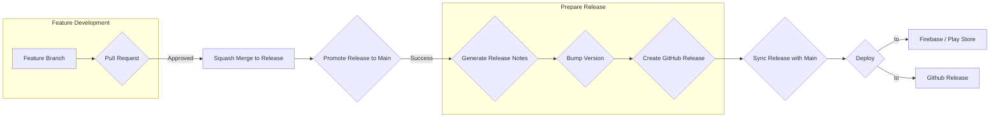
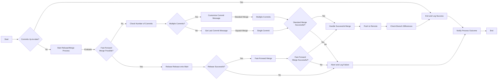
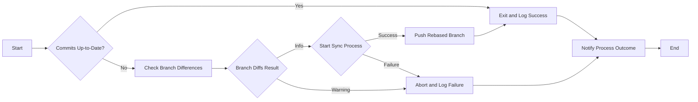

# Coding Conventions & Development Workflow

This document outlines the coding conventions on this Android project and describes the development workflow,
including branching strategy, commit message conventions, and codestyle guidelines.

## Unified Release Branching Strategy

We use a Git branching model with the following key branches:

- **`main`:** The main branch represents the stable, production-ready codebase.
- **`release`:** A long-lived branch for integrating features, preparing releases, and triggering the CD pipeline.

## Branch Naming Conventions

We follow these conventions for naming branches:

- **`feature/<feature-name>`:** For new features and enhancements.
- **`bugfix/<bug-name>`:** For bug fixes and patches.
- **`chore/<task-name>`:** For maintenance tasks, code style changes, etc.
- **`docs/<doc-name>`:** For documentation updates.
- **`refactor/<refactor-name>`:** For code refactoring.
- **`style/<style-name>`:** For code style changes and formatting.
- **`test/<test-name>`:** For adding or improving tests.
- **`ci/<ci-name>`:** For changes to the CI/CD pipeline.
- **`build/<build-name>`:** For changes to the build system or tooling.
- **`perf/<perf-name>`:** For performance improvements and optimizations.

## Conventional Commits

We use [Conventional Commits](https://www.conventionalcommits.org/) for writing consistent and informative commit messages. This convention helps to:

- **Automate Changelog generation:** The `android-deploy.yml` workflow uses [semantic-release](https://github.com/semantic-release/semantic-release)
  through a composite action to automatically generate release notes, bumps the app version, and update the `CHANGELOG.md` based on commit messages
  that follow the Conventional Commits specification.
- **Enforce semantic versioning:** `semantic-release` uses the commit message format to determine the appropriate version bump (major, minor, or patch)
  according to [Semantic Versioning](https://semver.org/) principles.
- **Improve code readability and maintainability:** Consistent commit messages make it easier to understand the history of changes and the reasoning
  behind them.

**Commit Message Format:**

`type(optional scope): description`

`optional body`

`optional footer(s)`

**Example:**

`feat: Add dark mode support`

`This commit introduces a new dark mode theme for the app.`

`BREAKING CHANGE: The default theme has been changed to dark mode.`

**Common Types:**

- **`feat`:**  A new feature.
- **`feat!`:** A new feature with a breaking change (indicated by the `!`).
- **`fix`:** A bug fix.
- **`chore`:**  Maintenance tasks or code style changes.
- **`chore(release)`:**  Release preparation and automation.
- **`docs`:** Documentation updates.
- **`refactor`:** Code refactoring.
- **`style`:** Code style changes (e.g., formatting).
- **`test`:** Adding or improving tests.
- **`ci`:** Changes to the CI/CD pipeline.
- **`build`:** Changes to the build system or tooling.
- **`perf`:** Performance improvements.

## Workflow

1. **Development:**
    - Create a new branch from the `main` branch using the appropriate naming convention (e.g., `feature/new-feature`, `bugfix/bug-fix`).
    - Develop the feature, bug fix, or other change on your branch.
    - Commit changes with descriptive messages following the Conventional Commits format.
    - Push your branch to the remote repository.

2. **Integration:**
    - Create a pull request (PR) to merge your branch into the `release` branch.
    - Ensure all CI checks pass and the code is reviewed.
    - Merge the PR into the `release` branch.

3. **Automated promotion to main:**
    - The `promote-release.yml` workflow is automatically triggered on every PR merge to the `release` branch.
    - This workflow attempts to rebase and merge the `release` branch into the `main` branch.

4. **Deployment:**
    - The `android-deploy.yml` workflow is automatically triggered on every push to the `main` branch (Triggered by the `promote-release` workflow).
    - This workflow performs the following tasks:
        - Runs `semantic-release` to analyze commits, determine the next version, generate release notes, bump app version, and create a GitHub release.
        - It synchronizes the `release` branch with `main` to incorporate the changes made by `semantic-release` to prevent future merge conflicts.
        - Deploys the app to Firebase App Distribution (and easily to Google Play Store when we're ready to publish).
        - Uploads the APK as a release asset on GitHub.

### Workflow Overview Graph

### Promote Release to Main Graph

### Sync Release with Main Graph

## Handling Merge Conflicts

- **Automated Workflow:** The automated rebase and merge process is designed to handle straightforward merges efficiently. It will only perform
  the merge if no conflicts are detected.
    - Refer to the [auto/promote-release.sh documentation](.github/scripts/release/auto/README.md#autopromote-releasesh) for details about this script and its implications.

- **Manual Script:** For complex merge scenarios or when conflicts arise, I created a dedicated script (`local/promote-release.sh`) to handle
  merge conflicts and perform interactive rebases. This script provides a convenient way to resolve conflicts manually and ensure a clean merge.
    - Refer to the [local/promote-release.sh documentation](.github/scripts/release/local/README.md#localpromote-releasesh) for detailed usage instructions and information.

- **Local Synchronization Script:** If the automated rebase and merge process fails for any reason, you can use the `local/sync-release.sh` script to
  synchronize the `release` branch with the `main` branch. This allows you to manually handle the situation and ensure the `release` branch is up-to-date.
    - Refer to the [local/sync-release.sh documentation](.github/scripts/release/local/README.md#localsync-releasesh) for detailed usage instructions and information.

- **Avoid Pull Request Conflicts:** To minimize the risk of merge conflicts and ensure your pull requests can be merged smoothly, consider the following:
    - You may want to check if the `release` branch is up-to-date with the `main` branch and run the `local/sync-release.sh` if needed.
    - Keep your branch up-to-date: Regularly rebase your feature branch onto the updated `main` branch using the command: `git rebase main`.
      This will incorporate the latest changes from `main` into your branch, reducing the likelihood of conflicts.
    - Address potential conflicts early: If you are aware of potential conflicts with ongoing work in other branches,
      coordinate with your team members and consider merging or rebasing your branch strategically to avoid major conflicts later.

## Branch Synchronization

To minimize merge conflicts and ensure that the `release` branch reflects the latest stable code,
we use an automated process to synchronize it with the `main` branch after each successful release.

**Automated Synchronization:**

The `android-deploy.yml` workflow automatically synchronizes the `release` branch with `main` after the `semantic-release` process completes successfully.
This involves rebasing the `release` branch onto `main` and force-pushing the changes.
This synchronization is crucial to our branching strategy and workflow for two reasons:

1.  The `auto/promote-release.sh` script, while ensuring identical content, alters commit hashes on `main`, potentially leading to future merge conflicts.
2.  The `semantic-release` process modifies the commit history on `main` by bumping the version number and updating the changelog,
    which can also cause merge conflicts if `release` is not updated.

By synchronizing the branches, we prevent potential merge conflicts and ensure that `release` always reflects the latest state of `main`,
including versioning and changelog information. This ensures a smooth and efficient workflow for managing releases and integrating new features.

## GitHub Actions Workflows

We use GitHub Actions for continuous integration and deployment. The following workflows are defined:

- **`android-test.yml`:** Runs tests and code analysis on every push to development branches and on PRs to `main` and `release`.
- **`promote-release.yml`:** Merges the release branch into the main branch (after PR merge into release).
- **`android-deploy.yml`:** Runs semantic-release and deploys the app to our chosen deployment platform (on push to main).

## Code Style and Conventions

For this project I chose Detekt, Ktlint, and Spotless to enforce consistent code style and coding conventions.

These tools are integrated into the build process and a pre-commit script that automatically checks your code before each commit. So ensure
that your code adheres to the defined style guidelines to avoid any issues during the commit process.

You can manually run these tools using the following commands:

- Detekt: `./gradlew detekt`
- Ktlint: `./gradlew ktlintCheck`
- Spotless: `./gradlew spotlessApply`

Optionally, for a more streamlined workflow, you can configure Android Studio to format your code with Ktlint on file save:

Install the [Detekt](https://plugins.jetbrains.com/plugin/10761-detekt) plugin and optionally
the [Ktlint](https://plugins.jetbrains.com/plugin/15057-ktlint) and/or [Spotless](https://plugins.jetbrains.com/plugin/18321-spotless-gradle)
plugins for Android Studio to get real-time feedback and inspections directly in the IDE.

You can configure and use them as its suits you best

1. Go to **`File` > `Settings` > `Tools` > `Actions on Save`**.
2. Enable the `Format with Ktlint` option.

If you prefer using shortcuts, you can configure keymaps for the installed plugins:

1. Go to **`File` > `Settings` > `Keymap`**.
2. Search for **`Ktlint`** or **`Spotless`** and assign your desired shortcuts to the available actions.

These tools help improve code quality by enforcing consistent code style, reduce code review time, and contribute to a more maintainable and consistent codebase.

## Important Notes

- Always create a new branch for each new feature or bug fix from the `main` branch.
- Follow the branch naming conventions.
- Write clear and descriptive commit messages using Conventional Commits.
- Ensure all CI checks pass before merging PRs.
