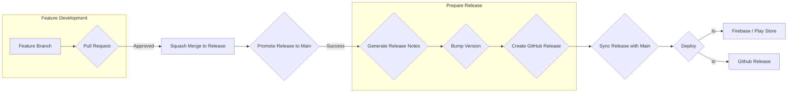

# Mini Soccer Simulator

## Overview

Mini Soccer Simulator is a simple Android application that simulates a football group stage.
The number of teams is configurable by modifying the `assets/teams.json` file, making it flexible to simulate group stages of different sizes.
The app generates random match results and displays the final standings.

This project is a demonstration of modern Android development practices, built entirely in Kotlin
and focused on Clean Architecture, Model-View-ViewModel (MVVM), SOLID principles, and a robust CI/CD pipeline.

## App Demo

## Development Workflow and Automation

This project showcases modern Android development practices while also establishing a solid CI/CD workflow that I can reuse and adapt as needed for my personal projects.

I thought it could be a good idea to have them both in the same project, so that it could serve as a practical example of how to implement such a workflow
in a real-world scenario.

The goal is to minimize manual intervention in the development lifecycle as much as possible, allowing developers to focus on building features
while maintaining a clean and linear commit history, avoiding merge commits whenever possible.

The workflow, documented in [Development Workflow](DEV_WORKFLOW.md), leverages modular composite actions and scripts,
providing flexibility to easily adapt and tailor the automation to specific project requirements and preferences.

It includes automated branch promotion, synchronization, semantic versioning, changelog generation, and deployment using GitHub Actions.

**Key aspects of the workflow:**

* **Feature Branch Workflow:** All development occurs on separate feature branches, ensuring that the main branch always remains stable.
* **Pull Requests:**  Code changes are reviewed through pull requests.
* **Code Analysis Tools:** Static analysis tools like Detekt and ktlint are employed to enforce coding standards and identify potential issues.
* **CI/CD:** An end-to-end CI/CD pipeline automates the build, test, and deployment processes.

I have many exciting ideas for new features and improvements to this CI/CD workflow that I plan to implement in the future when time allows. Stay tuned for updates!

### Workflow Overview Graph:

## Features

- **Match Simulation:** Simulates matches between teams, considering their relative strengths to produce realistic random outcomes.
- **Group Standings:** Presents a dynamic table showcasing the final group standings based on match results,
  highlighting the winning teams and adhering to standard football ranking rules (points, goal difference, goals for, etc.)
- **Round Winners Dialog:** Displays a summary of round results, including winners and their team logos, for a clear overview of each round's outcome.
- **User-Friendly Interface:** Provides a simple and intuitive user experience.

## Architecture: Clean Architecture with MVVM

The project combines the Clean Architecture and Model-View-ViewModel (MVVM):

- **Clean Architecture:**
    - **Data Layer:** Responsible for data access and persistence, interacting with repositories and data sources.
    - **Domain Layer:** Contains the core business logic and use cases, independent of any frameworks or UI.
    - **Presentation Layer:** Handles UI logic and user interactions, using ViewModels to interact with the domain layer.
- **MVVM:**
    - **Model:** Represents the data and business logic exposed by the domain layer.
    - **View:** Handles the user interface and user interactions.
    - **ViewModel:** Acts as the intermediary between the Model and View, fetching data from the domain layer, processing it, and exposing it to the View.

## Project Structure

Within the `app` module, packages are structured to follow Clean Architecture principles:

- **`data`:** Contains classes responsible for data access and persistence (repositories, data sources).
- **`di`:** Houses the Dagger Hilt modules for dependency injection.
- **`domain`:** Defines the core business logic and use cases.
- **`presentation`:** Contains the View and ViewModel components for different screens.

## Main Technologies Used

- **Kotlin:** The primary programming language for Android development.
- **Dagger Hilt:** A dependency injection framework for providing dependencies to different components of the application in a structured way.
- **ViewModel:**  Part of Android Jetpack, used for managing UI-related data in a lifecycle-conscious way, ensuring a smooth and responsive user experience.
- **LiveData:** Part of Android Jetpack, used for observing data changes and updating the UI accordingly.
- **Coroutines:** For handling asynchronous operations in a more concise and efficient way.
- **Detekt:** Static code analysis tool for Kotlin to ensure code quality and style consistency.
- **ktlint:** A Kotlin linter that helps maintain a consistent code style across the project.
- **Spotless:** A code formatter that helps enforce a consistent code style across multiple languages and formats.
- **Fastlane:** A tool for automating the building and releasing of mobile apps.
- **Semantic Release:** Automates the process of determining the next version number, generating release notes, and publishing releases on version control platforms.
- **GitHub Actions:** Used for continuous integration and continuous deployment (CI/CD) to automate the build, test, and deploy processes.

## Download

Download the latest APK: [MiniSoccerSimulator.apk](https://github.com/mustalk/MiniSoccerSimulator/releases/latest/download/minisoccersimulator-latest-release.apk)
